[TOC]

<br>

# 演示环境

本教程演示环境为

**Windows 10** + **MinGW(g++ (GCC) 12.2.0 )**

MinGW所用包为**w64devkit**： [https://github.com/skeeto/w64devkit/releases](https://github.com/skeeto/w64devkit/releases)

<span style="color: red;">如果能保持学习环境也是Windows 10 + MinGW最好。如果用的是Visual Studio或者其他的编译器，如果遇到结果与本教程演示不相同的部分，那就主要看教程中的演示，主要是理解指针的操作原理。所有编译器中指针操作原理是相同的，教程中在不同编译器会有不同结果的那些实验只为了理解指针而设计，实际中并不这样用。</span>

<br>

<br>

# 内存模型与指针

## 内存模型

C语言中指针的作用是用来操作内存，因此在正式开始指针内容学习之前，需要先对程序内存模型有一个大概的了解。

假设一个程序运行内存为4G，则简化后的内存模型如下图：

4G内存会被分为多个区域，在代码中可以直接进行数据读写的区域为**栈区(stack)** 和 **堆区(heap)**

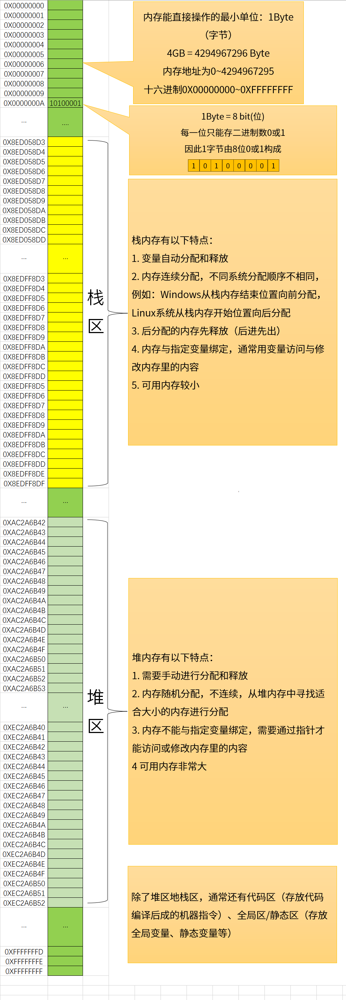

<mark>栈内存第2条特性只针对Linux+GCC以及Windows+MinGW的编译器组合。Visual Studio使用的分配方式与这两种都不相同。不过不影响指针行为的理解，只是可能有的实验在Visual Studio的环境下无法复现。不过大家放心，复现不现来的这些实验都是为了学习指针的特点设计的，所以在实际当中不会这样用，所以也不用担心实际写代码时在其他环境中无法使用。</mark>


> 实际内存要复杂得多，本图只是简单示意，**以下所有示意图，主要目的是用于理解指针的使用，因此可能有些不是特别严谨，不做过多深入。所有图示以Windows系统的处理方式作图，其他平台会有差异，但也不影响对指针的理解**


<br>

## 栈内存分配与取地址运算符

### 简单类型

[简单类型分配演示](pointer/index.html)

<br>

通过以下代码查看`&`运算符返回的地址：

```cpp
    char c1;
    char c2;
    char c3;

    int n1;
    int n2;
    int n3;

    double d1;
    double d2;
    double d3;

    printf("%X\n", &c1);
    printf("%X\n", &c3);
    printf("%X\n", &c2);

    printf("%X\n", &n1);
    printf("%X\n", &n2);
    printf("%X\n", &n3);

    printf("%X\n", &d1);
    printf("%X\n", &d2);
    printf("%X\n", &d3);
```

`&`操作符会返回对应变量第一个字节的地址，用来保存对应这些返回地址的变量称为指针：

```cpp
char *ptr1 = &c1;
int *ptr2 = &n1;
double *ptr3 = &d1;
```

可以通过指针操作对应地址的数据：

```cpp
    *ptr1 = 'A';
    *ptr2 = 150;

    printf("%X: %c\n", ptr1, c1);
    printf("%X: %d\n", ptr2, *ptr2);
```

### 结构体

在不进行内存对齐的情况下，结构体的大小等于其中每个成员大小之和。进行内存分配时按照结构体大小进行分配 ，分配的内存从前往后分别是结构体中的每人成员

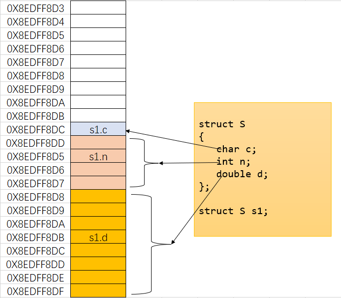

实际当中结构体会进行内存对齐，本次课程内容只讲解内存地址与指针关系，所以内存对齐不做深入，内存对齐的原因及对齐方式参考文章：https://www.zhihu.com/question/34020134/answer/3198670376

```cpp
    struct S
    {
        char c;
        int n;
        double d;
    };

    struct S s1;
    struct S *ptr = &s1;

    ptr->c = 'A';
    ptr->n = 100;
    ptr->d = 11.11;
```

<br>

### 一维数组

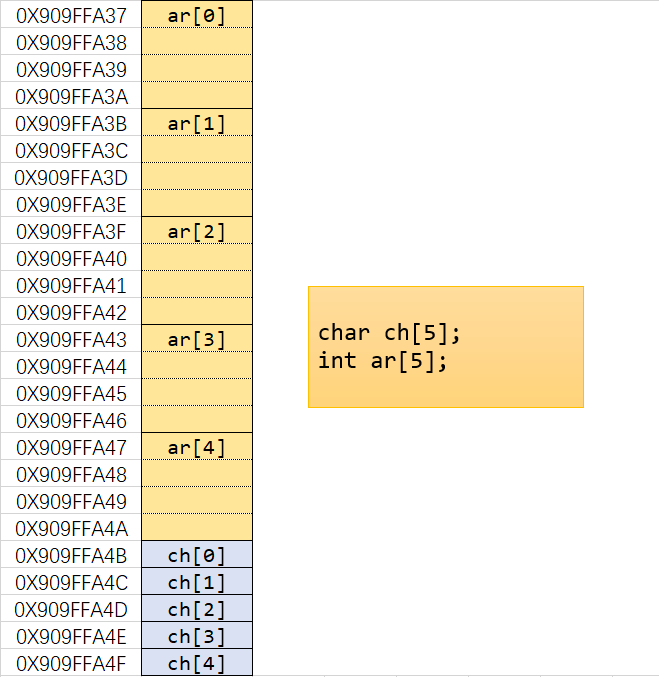

<br>

### 二维数组

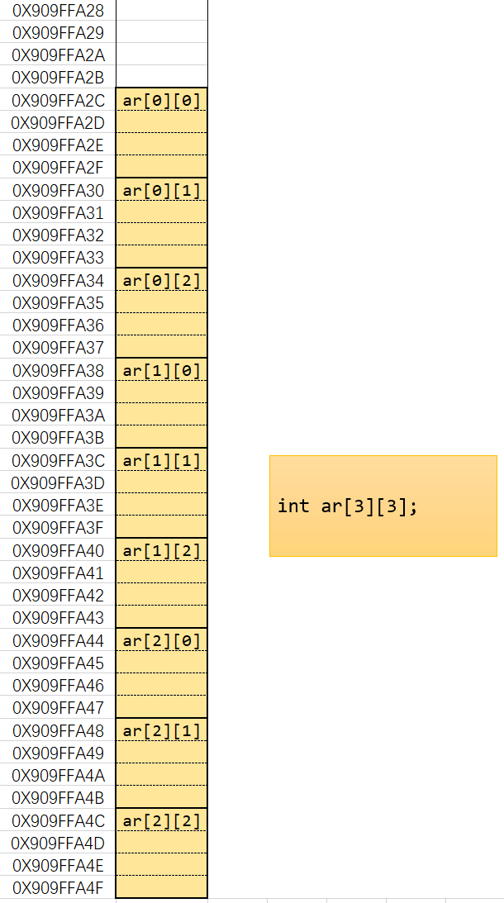

<br>

通过前面的演示可以得出以下结论：

- 取地址运算符`&`返回的都是变量对应内存第一个字节的地址（首地址）
- **指针是特殊的变量，存储的内容是其他数据的首地址**，各种类型指针变量大小都相同，为4字节或8字节（由操作系统及编译器决定）
- 指针是强类型的，声明时必须指明类型，因为程序需要根据类型判断需要解析多少内存数据以及如何进行解析

<br>

## 不同类型指针对数据的访问


<br>


## 指针理解：交换变量值

```cpp
void swap1(int x, int y)
{
    int tmp = x;
    x = y;
    y = tmp;
}

void swap2(int *x, int *y)
{
    int tmp = *x;
    *x = *y;
    *y = tmp;
}


int main()
{
    
    int a = 100;
    int b = 200;
    // swap1(a, b);
    swap1(a, b);
    printf("a = %d \tb = %d\n", a, b );
    
    return 0;
}
```

上面两个交换函数第一个是无法成功交换两个数值的，第二个可以成功交换，要理解这种现象产生的原因，需要先来看一个概念：


**栈帧**


**方式一 直接传递变量**

```cpp
void swap1(int x, int y)
{
    printf("address in swap1: &x = %X\t&y = %X\n", &x, &y);
    int tmp = x;
    x = y;
    y = tmp;
}

int main()
{
    
    int a = 100;
    int b = 200;

    printf("address in main: &a = %X\t&b = %X\n", &a, &b);
    swap1(a, b);
    printf("a = %d \tb = %d\n", a, b );
    
    return 0;
}
```

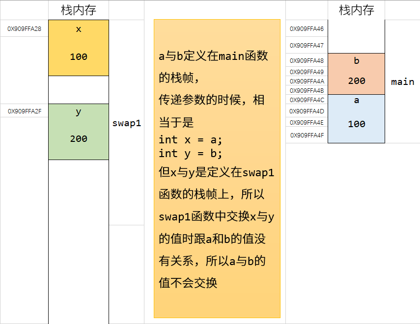


**方式二 传递指针**

```cpp
void swap2(int *x, int *y)
{
    printf("address in swap2: x = %X\t&y = %X\n", x, y);
    int tmp = *x;
    *x = *y;
    *y = tmp;
}

int main()
{
    
    int a = 100;
    int b = 200;

    printf("address in main: &a = %X\t&b = %X\n", &a, &b);
    swap2(&a, &b);
    printf("a = %d \tb = %d\n", a, b );
    
    
    return 0;
}
```


<br>

# 指向指针的指针（多重指针）

指针实际上也是一个变量，因此可以再定义一个指针指向它，这样的指针叫做指向指针的指针，也叫多重指针


要通过这些指针访问到`n1`操作如下

```cpp
int n1 = 1234;
int *ptr1 = &n1;
int ** ptr2 = &ptr1;
int *** ptr3 = &ptr2;

printf("ptr1: %d", *ptr1);
printf("ptr1: %d", **ptr2);
printf("ptr1: %d", ***ptr3);
```

<br>

# void指针与指针类型转换

前面使用的指针类型都需要指定具体的类型，某一指针类型的变量只能存对应类型的指针，如果类型不统一会报错，需要进行类型转换才可以。

void类型的指针可以称为空类型、或者是未指定类型的指针，可以用来存储任意类型的指针。因为没有类型，所以不能进行指针加减或数据访问等操作，需要转换为具体的类型再进行操作。

void指针只是用来存储一个首地址。

```cpp
    char c1;
    int n1;

    void *ptr1 = &c1;
    void *ptr2 = &n1;

    char *ptr3 = (char *)ptr1;
    int *ptr4 = reinterpret_cast<int*>(ptr2);
    *ptr4 = 100;

    printf("%d\n", n1);
```

<br>

# 指针加减运算

以`int *p1, *p2;`指针为例，其加减运算意义如下，其中`N`为正整数：

| 运算      | 意义                     |            |
|:-------:|:----------------------:|:----------:|
| p1 + N  | 从p1指针的位置向后移动N个`int`的距离 | 实际移动为N*4字节 |
| p1 - N  | 从p1指针的位置向前移动N个`int`的距离 | 实际移动为N*4字节 |
| p2 - p1 | p2与p1之间距离有多少个`int`     |            |


<mark>以下实验在Linux+GCC环境上没有问题。在Windows+MinGW环境上可能会有一些意想不到的问题。在Visual Studio环境上应该无法复现（其他编译器没有测试）。所以如果所用的环境上无法达到同样的效果也没关系，就看一下演示，理解一下指针加减法就行，在实际使用中不会写这样的代码，这个代码只是为了解释指针加减设计的。这部分本来是要结合数组来演示的，但是提前用这种方式来演示目的是为了说明指针运算本来就有这种特性，并不依赖数组</mark>

```cpp
    int n1 = 100;
    int n2 = 200;
    int n3 = 300;
    int n4 = 400;

    int *ptr = &n4; // Linux系统同样操作需要写为 &n1


    printf("%X\n", ptr + 1);
    printf("%d\n", *(ptr + 1));
    printf("%d\n", *(ptr + 2));
    printf("%d\n", *(ptr + 3));
```

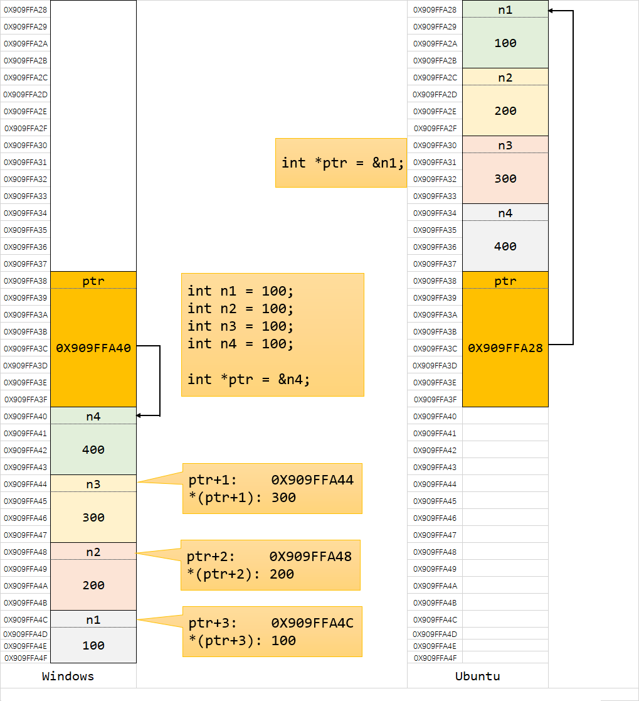

可以用同样的方法测试指针减法

```cpp
    int *ptr = &n1; // Linux系统同样操作需要写为 &n4


    printf("%X\n", ptr - 1);
    printf("%d\n", *(ptr - 1));
    printf("%d\n", *(ptr - 2));
    printf("%d\n", *(ptr - 3));
```

在上述操作中，`ptr+N`或`ptr-N`中的`N`或`-N`称为**指针偏移量**

上述通过指针偏移量来访问对应地址里面的数据还可以进行如下方式的简写

```cpp
    int *ptr = &n4; // Linux系统同样操作需要写为 &n1

    printf("%d\n", ptr[0]); // printf("%d\n", *ptr);
    printf("%d\n", ptr[1]); // printf("%d\n", *(ptr + 1));
    printf("%d\n", ptr[2]); // printf("%d\n", *(ptr + 2));
    printf("%d\n", ptr[3]); // printf("%d\n", *(ptr + 3));
```

看起来跟数组访问元素的方式一样吧，没错！不仅数组可以用下标的方式来访问元素，指针也可以用下标的方式来简写偏移量访问对应地址内的数据。

指针和数组之间的联系与相似之处非常多，后面再详细介绍两者的区别。

<br>

# 指针应用小试

## 判断字节序（小端存储/大端存储）

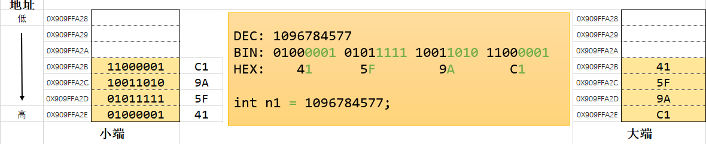

现代计算机中大多是以小端为字节序的。

C++20标准库中提供了方法来判断字节序

```cpp
#include <bit>
#include <iostream>

int main()
{
    if (std::endian::native == std::endian::big)
    {
        std::cout << "字节序为大端存储" << std::endl;
    }
    else if (std::endian::native == std::endian::little)
    {
        std::cout << "字节序为小端存储" << std::endl;
    }

    return 0;
}
```

但如果是C++20以前，或者是用C写程序，则不能使用上述方法来判断字节序，需要自行写程序来判断。

实现原理如下：

一个`int`类型为4字节，因此可以先定义一个`int`类型数据，再把每个字节的内容读取出来看一下就知道是以什么字节序存储的了。

```cpp
int n1 = 0X415F9AC1; // 用十六进制可以很清晰看出每个字节的内容

int *ptr1 = &n1; // 定义一个整形指针，这时如果直接用*ptr访问数据的话，会读取指针指向位置的4个字节
                // 我们需要的不是一次性把4个字节都读取出来，需要一次一个字节读取
      // 什么样的指针能读取一个字节呢？ 字符类型指针： char *, 但因为char的存储范围为-128~127
      // 所以需要用unsigned char 
unsigned char *ptr2 = (unsigned char *)ptr1; // 定义一个unsigned char*指针，
                                // 让它的值跟ptr1一样，
                           // 这时用*ptr2来访问数据，就只读取指针指向的第一个字节的数据了
printf("第一字节：%X\n", *ptr2);     // 以十六进制输出，可以对比上面的数字看每个字节的内容
printf("第二字节：%X\n", *(ptr2 + 1));
printf("第三字节：%X\n", *(ptr2 + 2));
printf("第四字节：%X\n", *(ptr2 + 3));
```


> 练习：写一个判断字节序的函数

再来看一个指针类型之间转换的例子，一个结构体，正常访问结构体成员的方法如下：

```cpp
#pragma pack(1) // 取消内存对齐

struct S
{
    char a1;
    int a2;
    double a3;
    int a4;
};

struct S s1;
struct S *ptr1 = &s1;

s1.a1 = 'a';
s1.a2 = 100;

ptr1->a3 = 300;
ptr1->a4 = 400;

printf("%c\n", ptr1->a1);
printf("%d\n", s1.a4);
```

但是我们注意到，`&s1`返回的是结构体的首地址，也就是结构体第一个成员的首地址，即`&s1`与`&s1.a1`返回的指针虽然类型不同，但值是相同的。`int`类型大小为4字节，因此对上述结构体，我们可以得到下表

| 成员  | 相对结构体首地址指针偏移量(字节) |
|:---:|:-----------------:|
| a1  | 0                 |
| a2  | 1                 |
| a3  | 5                 |
| a4  | 13                |

因此可以用下面的方式来访问结构体中的成员

```cpp
struct S *ptr1 = &s1;

char *c_ptr = (char *)ptr1;
printf("%c\n", *c_ptr); // 访问第一个成员

char *tmp_ptr = c_ptr + 1;
int *i_ptr1 = (int *)tmp_ptr;
printf("%d\n", *i_ptr1); // 访问第二个成员

tmp_ptr = c_ptr + 5;
double *d_ptr = (double *)tmp_ptr;
printf("%lf\n", *d_ptr); // 访问第三个成员

tmp_ptr = c_ptr + 13;
int *i_ptr2 = (int *)tmp_ptr;
printf("%d\n", *i_ptr2); // 访问第四个成员
```

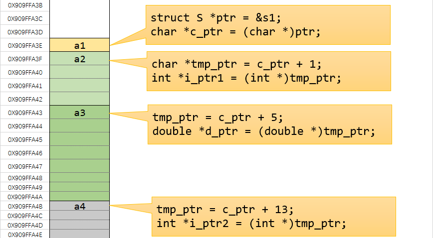

<br>

## qsort

在C标准库里提供了一个快速排序的函数qsort(quick-sort)，函数声明如下

```cpp
void qsort( void *ptr, size_t count, size_t size, int (*comp)(const void*, const void*));
```

参数

- ptr    -    指向待排序的数组的指针
- count    -    数组的元素数目
- size    -    数组每个元素的字节大小
- comp    -    比较函数。如果首个参数小于 第二个，那么返回负整数值，如果首个参数大于 第二个，那么返回正整数值，如果两个参数等价，那么返回零。

排序整形数组：

```cpp
#include <stdio.h>
#include <stdlib.h>


int cmp_int(const void *ptr1, const void *ptr2)
{
    int *i_ptr1 = (int *)ptr1;
    int *i_ptr2 = (int *)ptr2;

    int n1 = *i_ptr1;
    int n2 = *i_ptr2;

    if (n1 < n2)
    {
        return -1;
    }
    else if (n1 > n2)
    {
        return 1;
    }
    else
    {
        return 0;
    }
    // 以上if-else可简写为return n1 - n2; 如果要降序排列则用return n2 - n1;

    // 以上所有内容都可省略， 简写为 return *(int *)ptr1 - *(int *)ptr2;

}

int main()
{
    int ar[5] = {112, 955, 230, 189, 100};
    qsort(ar, 5, sizeof(int), cmp_int);

    for (int i = 0; i < 5; i++)
    {
        printf("%d\t", ar[i]);
    }

    return 0;
}
```

按指定字段对结构体数组进行排序

```cpp
#include <stdio.h>
#include <stdlib.h>


struct Person
{
    char name[20];
    int age;
    double score;
};


int cmp_struct_by_age(const void *ptr1, const void *ptr2)
{
    struct Person *s_ptr1 = (struct Person *)ptr1;
    struct Person *s_ptr2 = (struct Person *)ptr2;


    return s_ptr1->age - s_ptr2->age;
}

int main()
{
    struct Person s_ar[5] = {
        {"Tom", 66, 90.54},
        {"Jerry", 32, 94},
        {"John", 20, 70.22},
        {"Mike", 40, 60},
        {"Mark", 53, 65},
    };

    qsort(s_ar, 5, sizeof(struct Person), cmp_struct_by_age);


    for (int i = 0; i < 5; i++)
    {
        printf("{ name: %s, \tage: %d, \tscore: %lf }\n", s_ar[i].name, s_ar[i].age, s_ar[i].score);
    }


    return 0;
}
```

<br>

# 数组与指针

## 一维数组

在前面已经提过关于数组的内存分配，即按照数组所有元素大小之和一次分配对应的内存，数组里面的元素连续存储

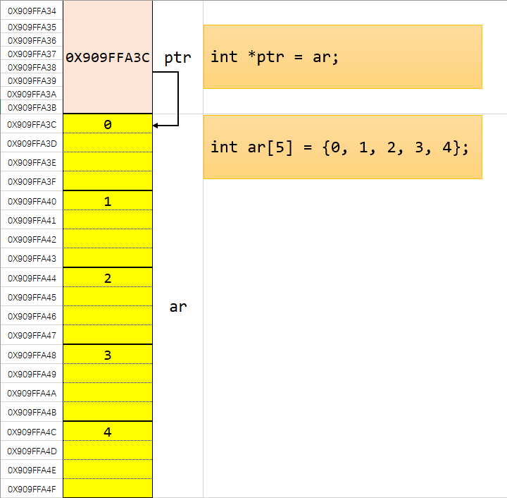

在数组与指针的关系中，有一条重要的规则：

**在表达式中直接使用数组名时，值为数组的首地址**

这就意味着，对上图中的数组来说，`ar`、`&ar[0]`、`&a`表示的地址值是一样的，都是数组的首地址，但它们的指针类型却不相同，其中直接使用数组名或者是`&ar[0]`返回的指针类型都是`int *`，而`&ar`返回的指针类型为`int (*)[5]`。

`&ar`返回的指针接收方式如下：

```cpp
int (*ptr)[5] = &ar;
```

详细说明见[变量声明](#附：变量声明)，关于这个类型的指针后面再作介绍。

先来看一下**指针对数组的基本操作**

```cpp
    int ar[5] = {100, 200, 300, 400, 500};

    int *ptr = ar; // 与 int *ptr = &ar[0]; 效果完全一样
    for (; ptr != (ar + 5); ptr++)
    {
        *ptr += 100;
    }
    for (ptr = ar; ptr != (ar + 5); ptr++)
    {
        printf("%d\t", *ptr);
    }
```

直接用数组名不仅能用下标的方式访问，也可以用指针的方式访问，同时指针也可以用下标的形式访问数组内容

```cpp
    int ar[5] = {100, 200, 300, 400, 500};
    int *ptr = ar;

    for (int i = 0; i < 5; i++)
    {
        printf("%d\t", *(ar + i));
        printf("%d\t", ptr[i]);
    }
```

可以看到数组与指针有许多相似之处，下面再来看一下数组作为函数参数的情况：

```cpp
void print_array(int a[5], int n)
{
    for (int i = 0; i < n; i++)
    {
        printf("%d\t", a[i]);
    }
    printf("\nprint_array sizeof a: %d\n", sizeof(a));
}


int main()
{

    int ar[5] = {100, 200, 300, 400, 500};

    print_array(ar, 5);

    printf("main sizeof ar: %d\n", sizeof(ar));

    return 0;
}
```

通过代码观察可以发现，`void print_array(int a[5], int n)`当中的`int a[5]`里面的数字可以随便写，也可以不写，直接是`int a[]`，最终会被转为`int *a`的形式，所以数组作为函数参数传递时，都是以指针的方式传递。

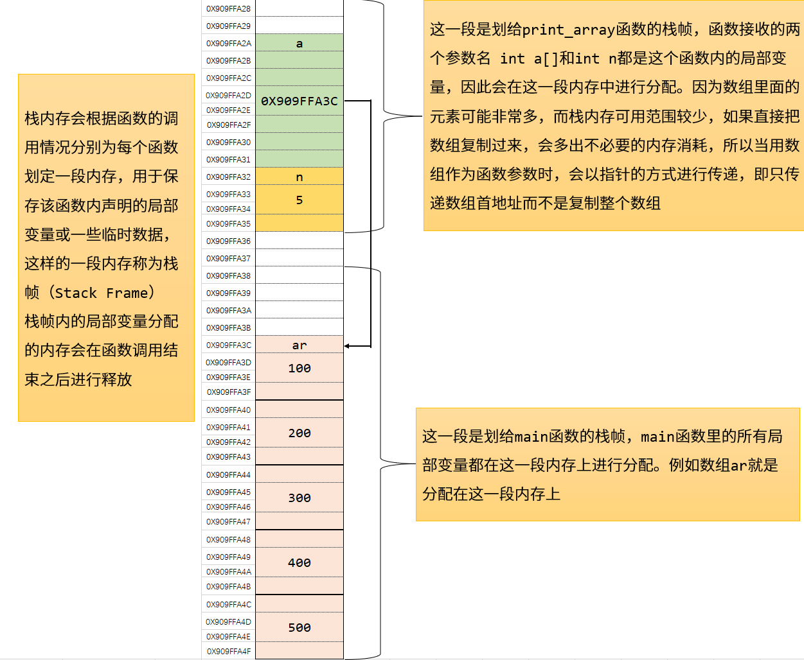

通过前面的例子，可以总结数组名与指针的一些异同：

以`int ar[5];`和`int *ptr = ar;`为例

| 数组名                                 | 指针                                 | 示例                                   |
|:-----------------------------------:|:----------------------------------:|:------------------------------------:|
| 可以用下标或指针偏移的方式访问                     | 可以用下标或指针偏移的方式访问                    | *(a + 2);   ptr[3];                  |
| 直接与数组对应内存绑定的一个变量                    | 一个单独变量，保存数组的首地址                    | 见下图                                  |
| 包含数组大小信息                            | 只是一个地址，不包含数组大小信息                   |                                      |
| 自身不可改变                              | 可以改变指针指向的地址                        | a++这种方式会报错，指针则可以进行ptr++或ptr=ar2这样的操作 |
| 进行指针偏移计算时直接从数组首地址开始进行计算             | 进行指针偏移时需要先取出指针变量中存储的地址，再从该地址进行偏移计算 | 见下图                                  |
| 在表达式中单独将数组名作为一个变量，例如当作函数参数传递时，退化为指针 |                                    | int *p = ar;  p = a + 3;             |

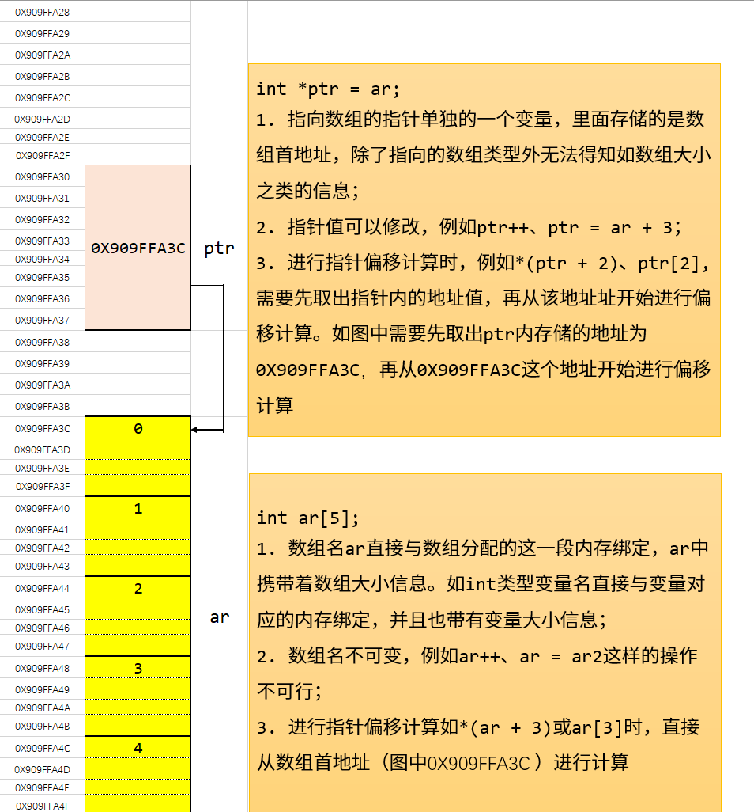

<br>

**其他操作**

前面用指针操作数组时，都是直接将指针指向数组首地址，且指针访问范围也在数组范围内，现在来看一下其他操作。

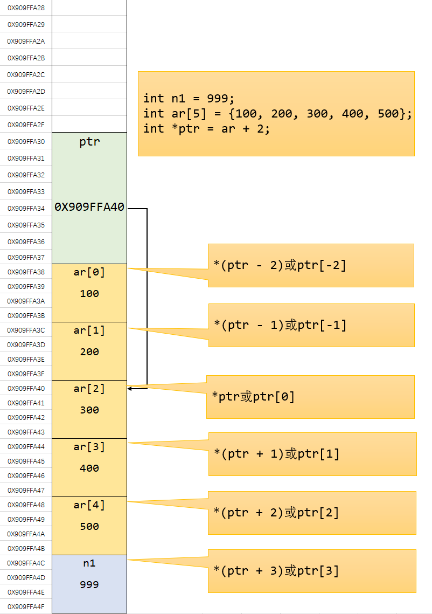

通过上面的演示可以得到如下结论：

- 如果相操作一个数组的子集，可以用一个或多个指针来指向对应的位置，即可重新从下标0开始访问对应那一段数据
- 指针与数组下标都可以是负数，即向前偏移，在使用数组名时千万不要把下标写为负，会访问或修改到不羽属于数组的内存数据
- C/C++中不会对数组或指针下标进行越界检查，因此当指针越界之后可能会访问或修改到不属于当前数组的值，在使用时要特别注意

**需要注意的是，用来操作数组元素的指针也是`int *`类型，和操作单个`int`类型变量的指针是一样的。实际上不管是数组还是单个变量，在内存上都是一样的，指针借助可以偏移的特性来访问不同位置的元素**

<br>

**数组类型指针**

下面讨论一个`&ar`返回的指针类型`int (*)[5]`，详细说明见[变量声明](#附：变量声明)

先来看几个简单类型的指针，`char *p`为指向字符类型的指针、`int *p`为指向`int`整型的指针、`struct Person *p`为指向结构体`Person`类型的指针，这些类型的指针如果用`p++`或者`p--`这样的操作，指针移动的字节数为一个对应的类型的大小。类比可以得出，`int (*ptr)[5]`为一个指向`int [5]`类型的指针，即指向一个有5个元素的`int`型数组的指针，因此`ptr++`或`ptr--`移动的大小为其指向类型的大小，即`int [5]`的大小，为20个字节，对一维数组来说，就是跳过整个数组的大小。

在表达式中出现时，数组名相关操作与指针对应关系如下

| 操作方式   | 返回的指针类型    | 说明                                                              |
|:------:|:----------:|:---------------------------------------------------------------:|
| ar     | int *      | 返回数组首地址，也就是数组第一个元素的首地址，返回的指针类型为一个指向`int`整型的指针，可以理解为是&ar[0]的简写形式 |
| &ar[0] | int *      | 返回数组第一个元素的首地址，类型为指向数组元素的指针                                      |
| &ar    | int (*)[5] | 返回数组首地址，但是一个指向整个数组类型的指针                                         |

其中最常用的是直接写数组名，`&ar`这种方式基本上不会用到，这里介绍这类指针目的是为二维数组与指针的操作做准备。

<br>

## 二维数组

要相理解二维数组指针的一些迷惑行为，我们先换个角度来理解什么是二维数组：

**二维数组实际上是一个一维数组，数组里的每个元素都是一个一维数组。**


<br>

类比前面的`char ch[5]`，数组里面的元素是`char`类型，因此直接使用数组名表示的是`char *`指针；`int ar[5]`，数组里面的元素是`int`类型，因此直接使用数组名表示的是`int *`指针……

现在的二维数组`int arr[3][4]`，当作一维数组来看，数组里面的元素类型为`int [4]`，因此直接使用数组名则为`int (*)[4]`指针

`int arr[3][4]`，在这个声明当中，变量名为`arr`，类型为`int [3][4]`，因此`&arr`返回的指针类型为

`int (*)[3][4]`

其中`arr[0]`、`arr[1]`、`arr[2]`则又分别表示一个一维数组，因此将其视为一维数组的数组名，在达式中直接使用一维数组数组名`arr[0]`、`arr[1]`、`arr[2]`则表示该一维数组的首地址，指针类型为`int *`；`&arr[0]`返回的则是指向整个数组类型的指针`int (*)[4]`

理解上述规则之后，二维数组指针操作也就同一维数组了

**二维数组作为函数参数**

最直观写法如下

```cpp
void print_array(int a[3][4], int n)
{
   // print code   
}


int main()
{

    int a[3][4] = {
        {1, 3, 3, 4},
        {3, 4, 7, 9},
        {1, 4, 6, 8}
    };

    print_array(a, 3);


    return 0;
}
```

通过测试可以发现`void print_array(int a[3][4], int n)`这个声明中，`int a[3][4]`中第一个下标的值可以不用写，即写成`int a[][4]`，但第二个下标不能省略。

类比一维数组`int a[5]`作为参数传递时会被改写为`int *`指针，上述维数组可以看作一维数组，其元素类型为`int [4]`，因此作为参数传递时会被改写为一个指向`int [4]`类型的指针，即`int (*a)[4]`，实际上`int a[][4]`只是`int (*a)[4]`的一种简写形式。

# 指针应用：动态内存

前面用指针来操作栈内存上的数据只是为了熟悉指针的规则与操作方式，指针真正发挥作用的地方是用来操作堆内存上的数据。栈内存上分配的地址可以和一个变量名绑定，通过变量名就能访问到对应内存里的数据。但是堆内存分配的地址不能绑定到变量名，只能通过指针来访问与操作，可以说如果没有指针，就没法访问与操作堆内存的数据。

堆内存与栈内存最大的不同在于可以动态申请与释放。

栈内存上的变量不能手动进行释放，只有等函数执行结束或者离开作用域之后分配的内存才会自动释放。

堆内存上分配的内存可以在程序运行时才确定，C/C++中需要手动进行内存管理，需要的时候进行内存分配，使用结束之后需要手动释放内存。

---

**C语言中动态分配与释放内存的函数**

```cpp
void* malloc(size_t size);
```

按照指定大小分配内存（单位为字节），返回指针类型为`void *`，即分配内存的首地址。分配失败返回`NULL`

```cpp
void* calloc(size_t num, size_t size);
```

`num`为需要分配的个数，`size`为每个元素的大小。分配成功会将分配的内存中所有字节初始化为0。返回指针类型为`void *`，即所分配内存的首地址。分配失败返回`NULL`

```cpp
void *realloc(void *ptr, size_t new_size);
```

重新分配内存。`ptr`为已分配内存的指针，`new_size`为重新分配内存大小（单位为字节）。如果`ptr`为`NULL`，则效果与`malloc`相同。

`realloc`在分配内存时按照以下步骤进行

- 直接在`ptr`指向的区域进行内存扩张或收缩，新旧大小中的较小者范围内的区域的内容保持不变。若扩张范围，则数组新增部分的内容不会进行初始化。
- （通常是扩张内存，`ptr`指向的区域没有足够的空闲内存来进行扩张时）分配一个大小为 `new_size` 字节的新内存块，并复制大小等于新旧大小中较小者的内存区域，然后释放旧内存块。分配失败不会释放旧内存块，返回`NULL`值。

```cpp
void free(void* ptr);
```

释放由`malloc`、`calloc`、`realloc`分配的内存。

**C++动态内存分配**

分配内存使用`new`和`new []`操作符，返回对应数据类型的指针。释放内存使用`delete`和`delete []`操作符。

## 单个变量内存分配与释放

```cpp
#include <stdio.h>
#include <stdlib.h>

int main()
{
    char *cptr1 = (char *)malloc(sizeof(char));
    char *cptr2 = (char *)malloc(sizeof(char));
    char *cptr3 = (char *)malloc(sizeof(char));


    printf("%X\n", cptr1);
    printf("%X\n", cptr2);
    printf("%X\n", cptr3);

    free(cptr1);
    free(cptr2);
    free(cptr3);


    return 0;
}
```

```cpp
#include <stdio.h>
#include <stdlib.h>

int main()
{
    char *cptr1 = new char;
    char *cptr2 = new char;
    char *cptr3 = new char;


    printf("%X\n", cptr1);
    printf("%X\n", cptr2);
    printf("%X\n", cptr3);

    delete cptr1;
    delete cptr2;
    delete cptr3;


    return 0;
}
```

通过上面输出的信息可以看到，堆内存上分配的地址并不是连续的，这是与栈内存连续分配不同的地方。

上面三个内存分配示意图如下

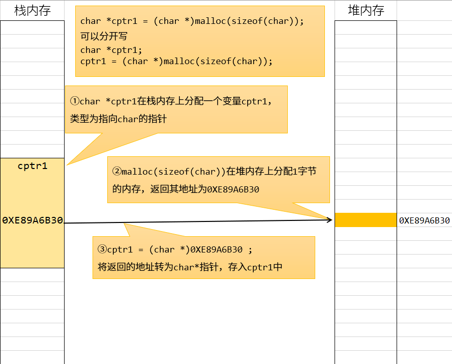 

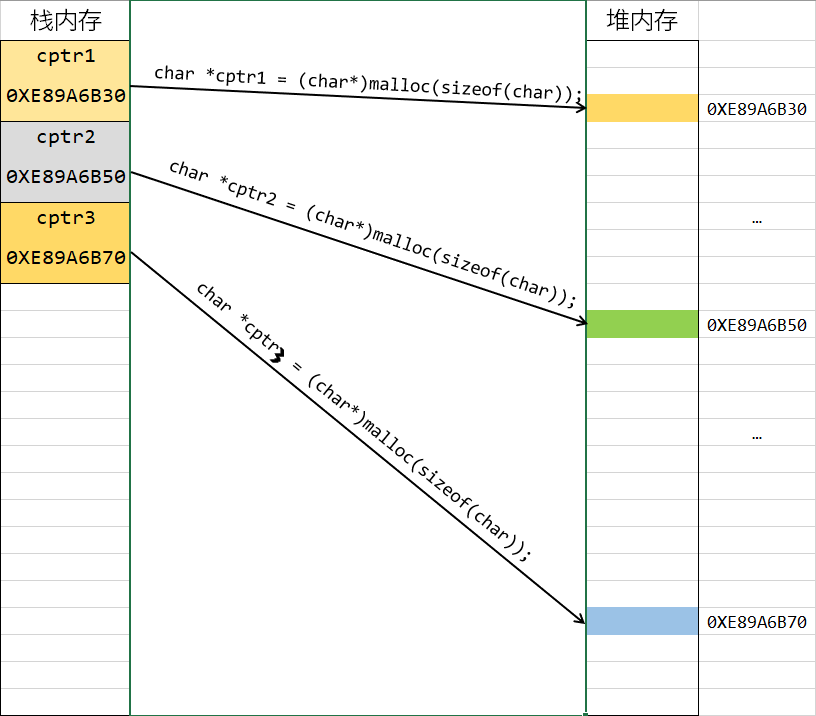

使用完成之后调用`free`或者`delete`释放对应的内存

```cpp
int *n_ptr = (int *)malloc(sizeof(int));
free(n_ptr);

// C++
int *n_ptr = new int;
delete n_ptr;
```


```cpp
double *d_ptr = (double *)malloc(sizeof(double));
free(d_ptr);

// C++
double *d_ptr = new double;
delete d_ptr;
```


```cpp
struct Person
{
    int num;
    int age;
    double score;
};

struct Person *s_ptr = (struct Person*)malloc(sizeof(struct Person));
free(s_ptr);

// C++
struct Person *s_ptr = new struct Person;
// C++中可以简写为
Person *s_ptr = new Person;

delete s_ptr;
```

C++中引入了类的概念，所以如果要为一个类在堆内存上分配内存，则要用`new`来分配，而不用C中的`malloc`，因为`malloc`、`calloc`这类函数虽然也能为类分配内存，但不会调用类的构造函数，`free`也不会调用类的析构函数，而`new`分配内存的同时会调用类的构造函数，`delete`释放内存时会调用类的析构函数

```cpp
#include <stdio.h>
#include <stdlib.h>


class Student
{
private:
    const char *name;
    int age;
    int grade;
public:
    Student() : name(NULL), age(0), grade(0)
    {
        printf("调用了Student类的无参构造函数\n");
    }

    Student(const char *name, int age, int grade) : name(name), age(age), grade(grade)
    {
        printf("调用了Student类的三参构造函数\n");
    }

    ~Student()
    {
        printf("调用了Student类的析构函数\n");
    }
};


int main()
{
    Student *ptr1 = new Student();
    Student *ptr2 = new Student("张三", 10, 5);

    Student *ptr3 = (Student*)malloc(sizeof(Student));

    free(ptr3);

    delete ptr1;
    delete ptr2;


    return 0;
}
```

<br>

## 一维数组内存分配与释放

前面使用的数组都是在栈上分配的，一般来说一个程序的栈内存空间并不大，而且栈内存上的数组分配之后大小无法修改，也无法手动释放，只有等该作用域程序结束之后才自动释放。如果数据较多或者需要动态调整数组的话就不适合存放在栈内存上。相对来说堆内存上可用空间非常多，而且数组大小可以动态调整，也可以随时根据需要进行分配和释放。

一维数组所用的指针与单个元素是相同的，单个变量的分配可以理解为只有一个元素的数组。

**用malloc和calloc分配数组**

```cpp
    int n = 5; // 动态数据，可以动态计算或者输入

    int *ar_ptr = (int *)malloc(sizeof(int) * n);

    for (int i = 0; i < n; i++)
    {
        printf("%d\t", ar_ptr[i]); 
        // printf("%d\t", *(ar_ptr + i)); 
    }


    printf("\n");

    int *ar_ptr2 = (int *)calloc(n, sizeof(int));

    for (int i = 0; i < n; i++)
    {
        printf("%d\t", ar_ptr2[i]); 
        // printf("%d\t", *(ar_ptr + i)); 
    }


    free(ar_ptr);    
    free(ar_ptr2);    
```

`malloc`需要计算出数组所需要的空间大小进行分配，`calloc`需要提供数组元素个数以及单个元素大小进行分配。二者的区别在于`malloc`只进行内存分配，不会初始化内存里的内容，`calloc`会将分配的内存都初始化为0。

**用new[]和delete[]来分配和释放数组内存**

相对来说C++中的数组分配方法简单许多：

```cpp
    int n = 10; // 数组大小，可以由运行时计算得到或者输入
    int *ptr = new int[n];

    for (int i = 0; i < n; i++)
    {
        printf("%d\t", ptr[i]); // *(ptr + i)
    }


    delete[] ptr;
```

只需要提供数组元素个数即可，而且C++的分配返回的即是对应类型的指针，不需要进行指针转换。

上面的方法也只是分配内存，并不进行数组初始化操作，如果要进行初始化，需要改成下面的写法：

```cpp
int *ptr = new int[n](); // 也可写成 new int[n]{};
```

这样的写法会将分配的内存初始化为0，还可以用指定的数组来初始化数组：

```cpp
int *ptr = new int[n]{1, 2, 3, 4};
```

但是这种初始化方式需要保证用来初始化的数据个数不超过`n`。


**用realloc动态调整数组的大小**

在堆内存上分配的数组大小可以根据需要进行调整：

```cpp
    int n = 10; // 数组大小，可以由运行时计算得到或者输入

    int size = sizeof(int) * n;

    int *ptr = (int *)malloc(size);
    for (int i = 0; i < n; i++)
    {
        ptr[i] = i;
    }
    printf("重新分配前：%X\n", ptr);

    ptr = (int *)realloc(ptr, size * 2);
    printf("重新分配后：%X\n", ptr);

    for (int i = 0; i < n * 2; i++)
    {
        printf("%d\t", ptr[i]);
    }


    free(ptr);
```

<br>

## 二维数组内存分配与释放

二维数组在堆内存上分配方式常用的有两种，一种是按照一维数组的方式来进行分配，另外一种是借助多重指针来进行分配。

**一维数组的分配方式**

现在我们假设要分配一个`int`类型二维数组`p[4][5]`

前面已经介绍过，可以将其看作一个有4个元素的一维数组，每个元素的类型为`int [5]`，即可按照一维数组的方式来进行分配

```cpp
    int n = 4; // 数组行数，可以由运行时计算得到或者输入

    // int (*ptr)[5] = (int (*)[5])malloc(sizeof(int [5]) * n);
    int (*ptr)[5] = (int (*)[5])calloc(n, sizeof(int [5]));

    for (int i = 0; i < n; i++)
    {
        for (int j = 0; j < 5; j++)
        {
            printf("%d\t", ptr[i][j]);
        }
        printf("\n");

    }


    free(ptr);
```

或者用C++的写法

```cpp
// int (*ptr)[5] = new int[n][5];
    int (*ptr)[5] = new int[n][5]();

    for (int i = 0; i < n; i++)
    {
        for (int j = 0; j < 5; j++)
        {
            printf("%d\t", ptr[i][j]);
        }
        printf("\n");

    }


    delete[] ptr;
```

这种分配方法将整个数组分配在一段连续的内存上面，也是比较简单的分配方法。不足之处在于只有行是动态的，列大小必须是确定的。

> 实际上对于有的编译器来说，用`malloc`或`calloc`来分配时列值也可以是动态的，但这种方法有的编译器可能不支持。用C++的方式来分配时也不支持动态列。

而且用这种方式分配出来的二维数组每一行的列数都是相同的。

现在假如我想分配一个二维数组，用来存下列数据

```txt
1         
1     1     
1     2     1     
1     3     3     1     
1     4     6     4     1    
1     5     10    10    5     1     
1     6     15    20    15    6     1    
1     7     21    35    35    21    7     1     
1     8     28    56    70    56    28    8     1     
1     9     36    84    126   126   84    36    9     1 
```

当然可以分配一个`10×10`的二维数组来进行存储，但是数组会有一半的空间是闲置的，假如说我就需要根据每行的数据个数来确定这一行分配多少个元素，分配一个各行的列数不相同的数组来存储这些内容，又该如何实现呢？

**多重指针分配二维数组**

这种方式用C语言的方式稍复杂一些，所以只演示一下C++当中的分配方式。

这种分配方式分配和释放过程都较复杂一些，但是行列大小都是可变的，并且可以做到不同行列数不同（这里主要是用来演示指针与堆内存管理的应用，实际当中也不会分配这样的数组），但在C++中，因为指针本身不带有数组大小信息，所以需要自己记录行列数值是多少（Java中数组自带length，分配这种数组简直爽歪歪）。

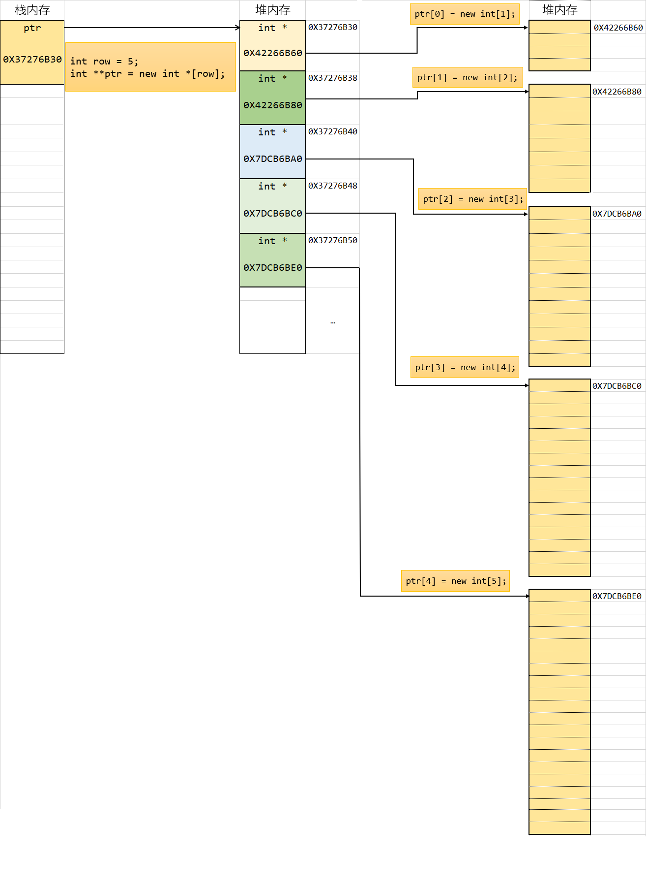

C++代码如下

```cpp
    int row = 5;
    int **ptr = new int *[row]();

    for (int i = 0; i < row; i++)
    {
        ptr[i] = new int[i + 1]();
    }

    for (int  i = 0; i < row; i++)
    {
        for (int j = 0; j <= i; j++)
        {
            printf("%d\t", ptr[i][j]);
        }
        printf("\n");
    }


    for (int i = 0; i < row; i++)
    {
        delete[] ptr[i];
    }


    delete[] ptr;
```

<br>

# 函数指针

不管是自定义的函数，例如前面定义的`print_array`还是标准库里的函数例如`printf`，其函数名也是一个内存地址，可以输出查看：

```cpp
    printf("%X\n", printf);
    printf("%X\n", print_array);
    printf("%X\n", main);
```

函数经编译后会生成二进制指令，运行时会载入内存当中，存在代码区，函数名则表示这个函数入口地址。


函数名表示该函数的入口地址，也就是该函数编译后的二进制指令存储区域的首地址。对于函数名来说，与数组名不同，直接使用函数名或者加上取地址符返回的指针类型都是一样的，即指向该函数的指针。例如在表达式中用`print_array`和`&print_array`是一样的。

如果一个指针变量里面存储的值为一个函数的入口地址，则这个指针就叫做函数指针


## 普通函数指针

```cpp
void hello()
{
    printf("hello world\n");
}

void fun()
{
    printf("另一个函数\n");
}

int add(int a, int b)
{
    return a + b;
}


int main()
{
    void (*pFun)();
    pFun = hello;
    (*pFun)();
    pFun = fun;
    pFun();

    int (*pFun2)(int, int) = add;

    printf("%d\n", pFun2(1, 10));

    int (*prt1)(const char *, ...) = printf;

    prt1("prt1\n");

    typedef int (*PRT)(const char *, ...);

    PRT prt2 = printf;
    PRT prt3 = printf;

    prt2("hello prt2\n");
    prt3("hello prt3\n");

    return 0;
}
```

函数指针一般是当作回调函数来使用，例如前面讲过的`qsort`函数

```cpp
void qsort(void *ptr, size_t count, size_t size, int (*comp)(const void *, const void *))
```

第四个参数`int (*comp)(const void *, const void *)`为函数指针，其返回值为`int`类型，参数为两个`const void *`指针，这里`const`修饰表示指针指向的内容不可改变，因为比较函数不须要改变源数据的内容，所以类型加上`const`

## 类成员函数指针

C++类中的公开函数也可以定义函数指针。

类中的函数分为静态函数与成员函数

静态函数与普通函数一样，定义指针之后可以直接调用

```cpp
class Student
{
public:
    static void StaticFun()
    {
        printf("这是静态成员函数\n");
    }

};    

void (*pFun)() = Student::StaticFun;
pFun();
```

成员函数的定义需要加上类名限制，而且成员函数调用必须依赖于对象实例

```cpp
class Student
{
private:
    const char *name;
    int age;
    int grade;

    void hello()
    {
        printf("hello");
    }
public:
    Student() : name("张三"), age(0), grade(0)
    {
        printf("调用了Student类的无参构造函数\n");
    }

    Student(const char *name, int age, int grade) : name(name), age(age), grade(grade)
    {
        printf("调用了Student类的三参构造函数\n");
    }

    ~Student()
    {
        printf("调用了Student类的析构函数\n");
    }

    static void StaticFun()
    {
        printf("这是静态成员函数\n");
    }

    virtual void PrintInfo()
    {
        printf("{ 姓名：%s, \t年龄：%d, \t年级：%d }\n", name, age, grade);
    }

    void PrintInfo2()
    {
        printf("{ 姓名：%s, \t年龄：%d, \t年级：%d }\n", name, age, grade);
    }


};


int main()
{
    Student stu("张三", 18, 12);
    Student *s_ptr = &stu;

    void (Student:: *pFun)() = Student::PrintInfo;

    (stu.*pFun)();
    (s_ptr->*pFun)();


    return 0;
}
```

具体应用比如Qt中信号与槽的连接

```cpp
QObject::connect(btn, &QButton::clicked, this, &MainWindow::onBtnClick)
```

信号与槽函数都可以自定义，定义完成之后调用`connect`进行连接，这里传入的就是对象指针与成员函数指针。

类似于，提供了一个功能函数，需要调用类中的成员函数，但事先并不知道类中对应的成员函数会定义成什么样子，就可以采用这样的方式来传入：

```cpp
class Student
{
private:
    const char *name;
    int age;
    int grade;

    void hello()
    {
        printf("hello");
    }
public:
    Student() : name("张三"), age(0), grade(0)
    {
        printf("调用了Student类的无参构造函数\n");
    }

    Student(const char *name, int age, int grade) : name(name), age(age), grade(grade)
    {
        printf("调用了Student类的三参构造函数\n");
    }

    ~Student()
    {
        printf("调用了Student类的析构函数\n");
    }

    static void StaticFun()
    {
        printf("这是静态成员函数\n");
    }

    void PrintInfo()
    {
        printf("{ 姓名：%s, \t年龄：%d, \t年级：%d }\n", name, age, grade);
    }

    void Hello()
    {
        printf("大家好，我是%s，今年%d岁\n", name, age);
    }


};
// QObject::connect(btn, &QButton::click, this, &MainWindow::onBtnClick)


void DoSomething(Student *ptr, void (Student:: *pFun)())
{
    printf("下面请开始表演：\n");
    (ptr->*pFun)();
}


int main()
{
    Student stu("张三", 18, 12);

    DoSomething(&stu, Student::Hello);
    DoSomething(&stu, Student::PrintInfo);


    return 0;
}
```

# 智能指针

C/C++中，堆内存需要手动进行管理，在使用完成之后要及时释放，代码量大了之后这是一件相当繁重的工作，而且经常会忘了释放内存，会造成资源浪费，严重的还会导致程序崩溃。

为了简化内存管理，C++提供了智能指针，可以自动进行内存释放。

C++中智能指针为`uniqu_ptr`(一个智能指针对象独占一个指针)和`shared_ptr`(多个智能指针对象可以共享一个指针)。其中`uniqu_ptr`对数组的支持比`shared_ptr`好一些。

**用普通方法构造智能指针**

```cpp
#include <stdio.h>
#include <memory>


class Student
{
private:
    const char *name;
    int age;
    int grade;

    void hello()
    {
        printf("hello");
    }
public:
    Student() : name("张三"), age(0), grade(0)
    {
        printf("调用了Student类的无参构造函数\n");
    }

    Student(const char *name, int age, int grade) : name(name), age(age), grade(grade)
    {
        printf("调用了Student类的三参构造函数\n");
    }

    ~Student()
    {
        printf("调用了Student类的析构函数\n");
    }

    static void StaticFun()
    {
        printf("这是静态成员函数\n");
    }

    void PrintInfo()
    {
        printf("{ 姓名：%s, \t年龄：%d, \t年级：%d }\n", name, age, grade);
    }

    void Hello()
    {
        printf("大家好，我是%s，今年%d岁\n", name, age);
    }


};


int main()
{

    std::unique_ptr<int> iptr(new int);
    *iptr = 1100;
    printf("%d\n", *iptr);

    std::shared_ptr<Student> stu_ptr(new Student);
    stu_ptr->PrintInfo();


    return 0;
}
```

**用make_unique和make_shared构造智能指针**

```cpp
   std::unique_ptr<int> iptr = std::make_unique<int>();
    *iptr = 1100;
    printf("%d\n", *iptr);

    std::shared_ptr<Student> stu_ptr = std::make_unique<Student>();
    stu_ptr->PrintInfo();

    std::shared_ptr<Student> stu_ptr2 = std::make_unique<Student>("李四", 18, 12);
    stu_ptr2->PrintInfo();
```

**数组**

对于数组，用`unique_ptr`可以用直接构造或`make_unique`构造

```cpp
    int count = 5;

    // std::unique_ptr<Student[]> ar(new Student[n]);
    std::unique_ptr<Student[]> ar = std::make_unique<Student[]>(count);

    for (int i = 0; i < count; i++)
    {
        ar[i].PrintInfo();
    }
```

`shared_ptr`只能用直接构造

```cpp
    int count = 5;

    std::shared_ptr<Student[]> ar(new Student[count]);

    for (int i = 0; i < count; i++)
    {
        ar[i].PrintInfo();
    }
```

二维数组

```cpp
    int row = 5;
    std::unique_ptr<int[][4]> ar = std::make_unique<int[][4]>(row); // 只有行可以是动态的

    for (int i = 0; i < row; i++)
    {
        for (int j = 0; j < 4; j++)
        {
            ar[i][j] = (i + 1) * (j + 1);
        }

    }

    for (int i = 0; i < row; i++)
    {
        for (int j = 0; j < 4; j++)
        {
            printf("%d\t", ar[i][j]);
        }
        printf("\n");
    }
```

**智能指针作为函数参数**

`shared_ptr`共享指针，所以可以直接用同样的`shared_ptr`当作参数

```cpp
void print_array(std::shared_ptr<int[]> ar, int row)
{
    for (int i = 0; i < row; i++)
    {
        printf("%d\t", ar[i]);
    }
    printf("\n");

}

int main()
{
    int row = 5;

    std::shared_ptr<int[]> ar(new int[row]);

    for (int i = 0; i < row; i++)
    {
        ar[i] = i;
    }

    print_array(ar, row);

    return 0;
}
```

`unique_ptr`独占指针，所以不能直接用相同类型当函数参数，所以需要用引用传递的方式

```cpp
void print_array(std::unique_ptr<int[]> &ar, int row)
{
    for (int i = 0; i < row; i++)
    {
        printf("%d\t", ar[i]);
    }
    printf("\n");

}

int main()
{
    int row = 5;

    std::unique_ptr<int[]> ar(new int[row]);

    for (int i = 0; i < row; i++)
    {
        ar[i] = i;
    }

    print_array(ar, row);

    return 0;
}
```

<br>

# 附：变量声明

注意一个规则：

**C/C++中变量的声明由两部分组成：变量类型和变量名，除了变量名，声明中的其他部分组成变量类型**

下表为一些声明的例子：

| 声明                           | 类型                  | 变量名  | &返回的指针类型                |
|:----------------------------:|:-------------------:|:----:|:-----------------------:|
| char c1;                     | char                | c1   | char *                  |
| int n1;                      | int                 | n1   | int *                   |
| double d1;                   | double              | d1   | double *                |
| int *ptr;                    | int *               | ptr  | int **                  |
| char *ptr                    | char *              | ptr  | char **                 |
| int ar[5];                   | int [5]             | ar   | int (*)[5]              |
| char ch[10];                 | char [10]           | ch   | char (*)[10]            |
| int ar\[3\]\[4\]             | int \[3\]\[4\]      | ar   | int (*)\[3\]\[4\]       |
| int *ar[3];                  | int *[3]            | ar   |                         |
| int (*ptr)[3];               | int (*)[3]          | ptr  |                         |
| int fun();                   | int ()              | fun  | int (*) ()              |
| void swap(int *p1, int *p2); | void (int *, int *) | swap | void (*) (int *, int *) |
| int *fun(int a1, int a2)     | int * (int , int )  | fun  | int * (*)(int , int )   |
| int (*pFun) (int a1, int a2) | int (*) (int , int) | pFun |                         |

> 需要注意区分`int *ptr[5]`和`int (*ptr)[5]`
> 
> - `int *ptr[5]`表示声明一个数组`ptr`，数组元素类型为`int *`
> - `int (*ptr)[5]`表示声明一个指针`ptr`，指向的是元素个数为5的一个`int`型数组
> 
> 

-----

> 注意区分 `int * fun(int a1)`和`int (*fun)(int a1)`
> 
> - `int * fun(int a1)`表示定义一个函数，函数名为`fun`，接收一个`int`类型参数，返回值为`int *`指针
> - `int (*fun)(int a1)`表示定义一个指针，指向类型为一个函数，这个函数接收一个`int`型参数，返回值 也是一个`int`类型